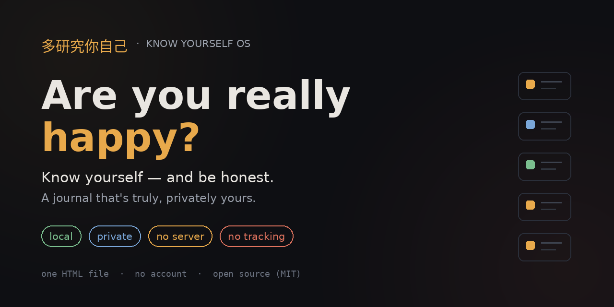

https://github.com/user-attachments/assets/af775887-4cab-4742-b301-e1b02f439cb5

# Know Yourself OS

### 多研究你自己

**Are you really happy?**

*Know yourself — and be honest. A journal that's truly, privately yours.*

`one html file` · `no account` · `no server` · `no tracking` · `your data never leaves your device`

---

## The honest pitch

Most "know yourself" content is a list of deep questions you read once, nod at, and forget by lunch.

This is the opposite. **Know Yourself OS** is a single, private, offline-first web page that turns self-reflection into a system you actually live by — answer honestly once, and it quietly becomes your daily compass, your weekly plan, and your safety net on bad days.

It started from a screenshot: a viral post of *"100 questions to ask yourself"* and a stranger's note that self-discovery is a kind of healing system — *find what makes you happy, and if something truly makes you happy, do it.* The questions were good. The format was forgettable. So this project asks the only question that matters underneath all the others — **are you really happy?** — and gives you a place to answer it that no one else can ever see.

---

## 🔒 Privacy is the whole point

This is not a wellness app that "respects your privacy." There is no company, no cloud, no account, and nothing to respect-or-not in the first place.

- **Everything is saved locally** in your browser's `localStorage`. It lives on your machine, full stop.
- **No backend. No database. No analytics. No cookies. No sign-up.** Open the HTML file; that's the entire system.
- **No one else can read your answers** — not us, not a server, because there is no server.
- **It is yours.** Export it, delete it, or carry the file to another machine. You own the data and the code.

> **The one honest exception:** the optional ✨ *Generate* buttons use AI. When you tap one, *only that section's answers* are sent **directly from your browser to the AI provider you chose** (your own Anthropic API key, or Claude inside Cowork) to write that single sentence — then the result comes back to your device. The app never stores your data anywhere else, and **AI is entirely optional** — every screen works fully by hand with no key. See [PRIVACY.md](PRIVACY.md) for the precise details.

If you want zero data to ever leave the device, simply don't enter an API key. You lose the auto-generation; you lose nothing else.

---

## What's inside

A complete personal operating system, organized as a loop: **understand yourself → live it daily → review weekly → reset when you fall.**

| Module | What it does |
| --- | --- |
| 🧩 **Profile** | A one-time onboarding self-portrait across **10 life pillars** (Energy, Flow, Strengths, Money & Freedom, Emotional OS, Social Energy, Growth, Fear & Courage, Values, Identity) — bilingual EN/中文. ~39 honest questions. Set once, edit when you genuinely change. |
| ⭐ **Mission** | Synthesizes your values + vision + money answers into a one-line **North Star** and 3 operating principles that everything else ladders up to. |
| 🌅 **Today** | Your daily touchpoint: one intention, an evening pulse (energy / mood / mission-alignment), a win, a drain, a streak counter, and a good-memory call-back. |
| 🗓️ **This Week** | Turns your experiments into a day-by-day calendar + action items + a checklist. **Download as PDF** or **send to WhatsApp** with one tap. |
| 🔄 **Weekly Review** | Trends from your check-ins, experiment check-off, and an AI summary that feeds next week's plan — so it compounds instead of resetting. |
| 📓 **Journal** | Capture happy moments and honest notes. Pinned and happy entries resurface on **Today** and inside **Reset** — the memories you most need, when you need them. |
| 🌿 **Reset** | The bad-day button. A calm, 5-step rescue built from **your own words**: breathe, your own listed soothers, your negative story gently reframed, a happy memory, and one tiny next step. |
| 📖 **Operating Manual** | Every distilled truth + experiment in one exportable page. |

---

## Screenshots

> Capture a few real screens and drop the PNGs into `docs/`, then uncomment the block below. Real shots (with a little sample content) sell the project far better than mockups.

<!--
| Profile | Today | This Week |
| --- | --- | --- |
|  |  |  |

| Mission | Reset | Journal |
| --- | --- | --- |
|  |  |  |
-->

---

## Quick start

**Option A — just use it (30 seconds)**
1. Download [`index.html`](index.html) (or clone this repo).
2. Double-click it. It opens in your browser. Done.
3. Start with the **Profile** pillars. Everything saves automatically.

> Manual mode needs nothing else — no internet, no key, no setup.

**Option B — turn on AI generation (optional)**
1. Get an Anthropic API key at [console.anthropic.com](https://console.anthropic.com).
2. Open **⚙️ AI Settings** in the app, paste your key, pick a model (Haiku = cheapest/fastest), and hit **Test connection**.
3. The ✨ *Generate* buttons now write your distillations, mission, weekly plan, and reset reframes for you. The key is stored only on your device.

**Option C — run it inside [Claude Cowork](https://www.anthropic.com)**
The app auto-detects Cowork and uses Claude there with no key required.

---

## How to use it well

There's a natural rhythm:

**Once (onboarding):** Block ~30–45 honest minutes and fill in the **Profile** pillars. Don't perform — write what's actually true, even when it's unflattering. Then generate your **Mission**.

**Daily (~2 min):** Open **Today**. Set one intention in the morning; do the evening pulse at night. Drop good moments into the **Journal** as they happen.

**Weekly (~5 min):** Run the **Weekly Review**, then **Plan my week** to get a fresh schedule. Send it to your phone via PDF or WhatsApp.

**Whenever it's heavy:** Hit **Reset**. It's there for exactly the moments you don't want to think clearly.

**Every few months:** Re-read your Profile. The point isn't to keep the answers frozen — it's to notice what changed, and whether you're any closer to *yes* on the only question that matters.

---

## How to optimize your answers

The system is a mirror — it reflects the quality of what you put in.

- **Be specific, not aspirational.** "I want to be disciplined" is noise. "I do my best thinking 7–9am before anyone texts me" is signal the system can actually schedule around.
- **Answer 2–4 questions per pillar before generating.** The ✨ distill reads everything you wrote; more honest input = a sharper, truer one-liner.
- **Edit the AI output.** It's a first draft of *your* truth, not gospel. If it's 90% right, fix the 10% — that act of correction is itself the reflection.
- **Pick the right model.** Haiku is great and cheap for daily use. Switch to Sonnet or Opus in Settings when you want more nuance for your Mission or a hard Reset day.
- **Keep the Journal fed.** The Reset and Today call-backs are only as good as the memories you've saved. Five seconds to log a happy moment pays off on your worst day.
- **Treat experiments as experiments.** Small, concrete, this-week. Then actually check them off in the Weekly Review. Compounding beats intensity.

---

## Self-hosting & deploying

It's a static file, so it deploys anywhere:

- **GitHub Pages:** push this repo, enable Pages on the `main` branch → live at `https://<you>.github.io/know-yourself-os/`.
- **Netlify / Vercel / Cloudflare Pages:** drag-and-drop the folder or connect the repo. Zero build step.
- **Local:** literally just open `index.html`.

**A note on the API key when you deploy publicly:** the app *never* embeds a key — each visitor enters their own under Settings, stored in their own browser. So a public deploy exposes no secrets. If you ever want to offer AI *without* asking visitors for a key, don't hard-code your key in the HTML; instead put a tiny serverless proxy (e.g. a Cloudflare Worker) between the page and the API and call that. The current build is designed for the bring-your-own-key model, which keeps it 100% static and private.

---

## Your data, your control

- **Where it lives:** browser `localStorage`, under the key `knowYourselfOS_v2`.
- **Export:** **Operating Manual → Export Markdown** gives you a portable `.md` of everything.
- **Move devices:** export, or copy the `localStorage` value via your browser console.
- **Wipe it:** **Operating Manual → Reset all data**, or clear site data in your browser. Gone for good.

---

## Tech

Plain **HTML + CSS + vanilla JavaScript** in one file. No framework, no dependencies, no build. ~1,000 lines you can read in an afternoon. The only network call the app can make is the optional, user-initiated request to the AI provider.

---

## Roadmap ideas

- Encrypted export / import with a passphrase
- Optional self-hostable sync between your own devices (end-to-end encrypted)
- Trend charts for energy/mood/alignment over months
- More pillars (Leverage & Time, Relationships, Health)
- i18n beyond EN/中文
- A serverless proxy template for keyless AI deploys

PRs and ideas welcome — see [CONTRIBUTING.md](CONTRIBUTING.md).

---

## Contributing

This is meant to be forked, remixed, and made yours. Open an issue, send a PR, or just clone it and change the questions to ones that matter to *you*. See [CONTRIBUTING.md](CONTRIBUTING.md).

## Author

Created and maintained by **[Raincakgyrzahmou](https://github.com/Raincakgyrzahmou)**.

## License

[MIT](LICENSE) © [Raincakgyrzahmou](https://github.com/Raincakgyrzahmou) — do almost anything, just keep the notice. Build on it freely.

---

*Inspired by a 100-questions post and a stranger named Heidi who said self-discovery is a healing system.*

**So — are you really happy? There's a private place to find out. ↑**

